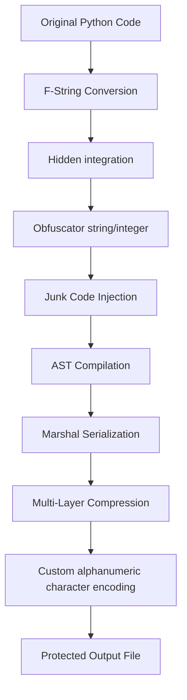

## 🌀 IzumKonata Obfuscator
-> High-Speed Obfuscation Engine – Advanced Anti-Tamper – Multi-Layer Compression

-> A powerful, high‑speed Python obfuscator with multi‑layer protection, featuring anti-debug, anti-tamper, anti-hook requests, and a fully customized encryption system.

## 🌟 Outstanding features

🔐 1. Obfuscation According to AST

-> IzumKonata operates directly on AST (Abstract Syntax Tree), helping:

-> Code structure is completely changed

-> Almost impossible to reverse to original form

-> All strings, ints are encoded through multi-layer lambda

## 🛡 2. Extremely Strong Anti-Debug / Anti-Tamper / Anti-Hook

>> Integrates nearly 70+ security checks, including:

-> Do not allow file editing

-> Check fixed line number

-> Check builtins are hooked

-> Check module requests are replaced

-> Prohibit sitecustomize / usercustomize

-> Check all method ID & source of class

-> Check user key & CRC to prevent cracking

## ⚙️ 3. Multi-Layer Compression

→ After compiling to bytecode, the code passes through a 4-layer compression chain:

- LZMA

- ZLIB

- BZ2

- Base85 (A85)

→ Result: extremely hard to analyze and nearly unreadable.

## 🧩 4. Built-in Protection (Hide Builtins)

All built-in functions such as eval, exec, print, len, ...
are protected with anti-hook + anti-debug mechanisms.

## 🗑 5. Junk Code Injection

Random junk code is inserted into every block.

## ✨ 6. F-String to Join Conversion

-> Prevents grepping or detection of real content.

## 🎨 7. Beautiful Banner + CLI

-> Uses pystyle to create an attractive command-line interface.

## 📊 Obfuscation Process

## 🚀 Installation

Python 3.6 or later

Module: pystyle (auto install if missing)

## 📖 Usage

-> Run the obfuscator depending on your device:

-> Android (Termux): python Izu311.py or python Izu312.py

-> Windows CMD / PC: python Izu311.py or python Izu312.py

- Enter the file to encode:
- Enter File: your_script.py

- Enter the username to embed:
- Enter Your Username! [For example: 'AnhNguyenCoder']:

# Choose options:
Do you want high security? Yes (Y) | (N) No:
Anti-Crack? (Y) Yes | (N) No:
Anti-Debug? (Y) Yes | (N) No:

# After encoding:
-> Saved file name: obf-your_script.py
-> Execution time: 0.00s

## ⚠️ Important Notice

-> This tool is intended solely for legal code protection purposes. The author is not responsible for any misuse!

## 🤝 Contributing

->> We welcome all contributions! Please submit a Pull Request. For major changes, open an Issue to discuss what you want to modify.

## 📞 Contact
-> Author: Nguyen Nhat Nam Anh

-> Telegram: https://t.me/ctevclwar

-> Facebook: https://www.facebook.com/ng.xau.k25
